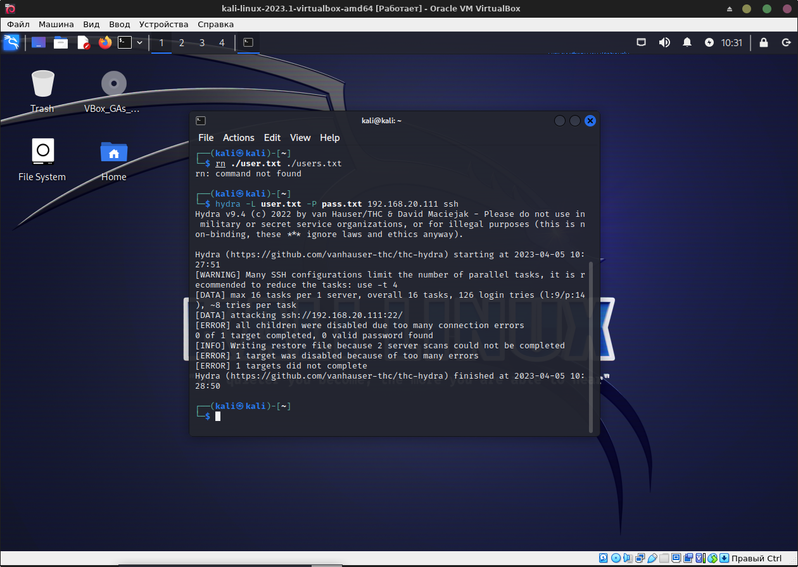

# Домашнее задание к занятию "`13.3. «Защита сети»`" - `Живарев Игорь`


### Задание 1


Разведка системы, логи Suricata:

Реакция Suricata на sudo nmap -sA 192.168.20.111
<нет изменений>
Скорее всего, модуль для обнаружения данной атаки по умолчанию не установлен. Что бы Suricata начала реагирование на данный тип сканирования, необходимо использовать модуль Emerging Threat. Для его установки требуется выполнение команды sudo suricata-update.

Реакция Suricata на sudo nmap -sT 192.168.20.111
```
igor@vm1:~$ sudo tail -f /var/log/suricata/fast.log
04/04/2023-15:44:22.984046  [**] [1:2010937:3] ET SCAN Suspicious inbound to mySQL port 3306 [**] [Classification: Potentially Bad Traffic] [Priority: 2] {TCP} 192.168.20.101:52838 -> 192.168.20.111:3306
04/04/2023-15:44:23.006710  [**] [1:2010936:3] ET SCAN Suspicious inbound to Oracle SQL port 1521 [**] [Classification: Potentially Bad Traffic] [Priority: 2] {TCP} 192.168.20.101:48540 -> 192.168.20.111:1521
04/04/2023-15:44:23.021770  [**] [1:2002911:6] ET SCAN Potential VNC Scan 5900-5920 [**] [Classification: Attempted Information Leak] [Priority: 2] {TCP} 192.168.20.101:55644 -> 192.168.20.111:5901
04/04/2023-15:44:23.040599  [**] [1:2002910:6] ET SCAN Potential VNC Scan 5800-5820 [**] [Classification: Attempted Information Leak] [Priority: 2] {TCP} 192.168.20.101:49666 -> 192.168.20.111:5810
04/04/2023-15:44:23.049172  [**] [1:2010935:3] ET SCAN Suspicious inbound to MSSQL port 1433 [**] [Classification: Potentially Bad Traffic] [Priority: 2] {TCP} 192.168.20.101:43228 -> 192.168.20.111:1433
04/04/2023-15:44:23.071351  [**] [1:2010939:3] ET SCAN Suspicious inbound to PostgreSQL port 5432 [**] [Classification: Potentially Bad Traffic] [Priority: 2] {TCP} 192.168.20.101:54742 -> 192.168.20.111:5432

```

sudo nmap -sS 192.168.20.111
```
igor@vm1:~$ sudo tail -f /var/log/suricata/fast.log
04/04/2023-15:47:08.494870  [**] [1:2010937:3] ET SCAN Suspicious inbound to mySQL port 3306 [**] [Classification: Potentially Bad Traffic] [Priority: 2] {TCP} 192.168.20.101:40258 -> 192.168.20.111:3306
04/04/2023-15:47:08.511126  [**] [1:2010939:3] ET SCAN Suspicious inbound to PostgreSQL port 5432 [**] [Classification: Potentially Bad Traffic] [Priority: 2] {TCP} 192.168.20.101:33152 -> 192.168.20.111:5432
04/04/2023-15:47:08.517688  [**] [1:2010935:3] ET SCAN Suspicious inbound to MSSQL port 1433 [**] [Classification: Potentially Bad Traffic] [Priority: 2] {TCP} 192.168.20.101:59268 -> 192.168.20.111:1433
04/04/2023-15:47:08.520748  [**] [1:2002911:6] ET SCAN Potential VNC Scan 5900-5920 [**] [Classification: Attempted Information Leak] [Priority: 2] {TCP} 192.168.20.101:46658 -> 192.168.20.111:5907
04/04/2023-15:47:08.550672  [**] [1:2010936:3] ET SCAN Suspicious inbound to Oracle SQL port 1521 [**] [Classification: Potentially Bad Traffic] [Priority: 2] {TCP} 192.168.20.101:39954 -> 192.168.20.111:1521
04/04/2023-15:47:08.554178  [**] [1:2002910:6] ET SCAN Potential VNC Scan 5800-5820 [**] [Classification: Attempted Information Leak] [Priority: 2] {TCP} 192.168.20.101:38052 -> 192.168.20.111:5815

```

Реакция Suricata на sudo nmap -sV 192.168.20.111
```
igor@vm1:~$ sudo tail -f /var/log/suricata/fast.log
04/04/2023-15:49:34.665178  [**] [1:2010937:3] ET SCAN Suspicious inbound to mySQL port 3306 [**] [Classification: Potentially Bad Traffic] [Priority: 2] {TCP} 192.168.20.101:57386 -> 192.168.20.111:3306
04/04/2023-15:49:34.680384  [**] [1:2010939:3] ET SCAN Suspicious inbound to PostgreSQL port 5432 [**] [Classification: Potentially Bad Traffic] [Priority: 2] {TCP} 192.168.20.101:39880 -> 192.168.20.111:5432
04/04/2023-15:49:34.681266  [**] [1:2010936:3] ET SCAN Suspicious inbound to Oracle SQL port 1521 [**] [Classification: Potentially Bad Traffic] [Priority: 2] {TCP} 192.168.20.101:57530 -> 192.168.20.111:1521
04/04/2023-15:49:34.697804  [**] [1:2002911:6] ET SCAN Potential VNC Scan 5900-5920 [**] [Classification: Attempted Information Leak] [Priority: 2] {TCP} 192.168.20.101:58690 -> 192.168.20.111:5915
04/04/2023-15:49:34.705054  [**] [1:2010935:3] ET SCAN Suspicious inbound to MSSQL port 1433 [**] [Classification: Potentially Bad Traffic] [Priority: 2] {TCP} 192.168.20.101:57734 -> 192.168.20.111:1433
04/04/2023-15:49:34.741163  [**] [1:2002910:6] ET SCAN Potential VNC Scan 5800-5820 [**] [Classification: Attempted Information Leak] [Priority: 2] {TCP} 192.168.20.101:41070 -> 192.168.20.111:5810
04/04/2023-15:49:40.927315  [**] [1:2023668:4] ET INFO Unconfigured nginx Access [**] [Classification: Potentially Bad Traffic] [Priority: 2] {TCP} 192.168.20.111:80 -> 192.168.20.101:34050
04/04/2023-15:49:40.937021  [**] [1:2009358:6] ET SCAN Nmap Scripting Engine User-Agent Detected (Nmap Scripting Engine) [**] [Classification: Web Application Attack] [Priority: 1] {TCP} 192.168.20.101:47400 -> 192.168.20.111:80
04/04/2023-15:49:40.937021  [**] [1:2024364:4] ET SCAN Possible Nmap User-Agent Observed [**] [Classification: Web Application Attack] [Priority: 1] {TCP} 192.168.20.101:47400 -> 192.168.20.111:80
04/04/2023-15:49:40.939329  [**] [1:2009358:6] ET SCAN Nmap Scripting Engine User-Agent Detected (Nmap Scripting Engine) [**] [Classification: Web Application Attack] [Priority: 1] {TCP} 192.168.20.101:47416 -> 192.168.20.111:80
04/04/2023-15:49:40.939329  [**] [1:2024364:4] ET SCAN Possible Nmap User-Agent Observed [**] [Classification: Web Application Attack] [Priority: 1] {TCP} 192.168.20.101:47416 -> 192.168.20.111:80
04/04/2023-15:49:40.941358  [**] [1:2023668:4] ET INFO Unconfigured nginx Access [**] [Classification: Potentially Bad Traffic] [Priority: 2] {TCP} 192.168.20.111:80 -> 192.168.20.101:47426
04/04/2023-15:49:40.943646  [**] [1:2009358:6] ET SCAN Nmap Scripting Engine User-Agent Detected (Nmap Scripting Engine) [**] [Classification: Web Application Attack] [Priority: 1] {TCP} 192.168.20.101:47442 -> 192.168.20.111:80
04/04/2023-15:49:40.943646  [**] [1:2024364:4] ET SCAN Possible Nmap User-Agent Observed [**] [Classification: Web Application Attack] [Priority: 1] {TCP} 192.168.20.101:47442 -> 192.168.20.111:80
04/04/2023-15:49:40.944221  [**] [1:2009358:6] ET SCAN Nmap Scripting Engine User-Agent Detected (Nmap Scripting Engine) [**] [Classification: Web Application Attack] [Priority: 1] {TCP} 192.168.20.101:47446 -> 192.168.20.111:80
04/04/2023-15:49:40.944221  [**] [1:2024364:4] ET SCAN Possible Nmap User-Agent Observed [**] [Classification: Web Application Attack] [Priority: 1] {TCP} 192.168.20.101:47446 -> 192.168.20.111:80
04/04/2023-15:49:40.948222  [**] [1:2023668:4] ET INFO Unconfigured nginx Access [**] [Classification: Potentially Bad Traffic] [Priority: 2] {TCP} 192.168.20.111:80 -> 192.168.20.101:47456
04/04/2023-15:49:40.951094  [**] [1:2023668:4] ET INFO Unconfigured nginx Access [**] [Classification: Potentially Bad Traffic] [Priority: 2] {TCP} 192.168.20.111:80 -> 192.168.20.101:47462

```

Разведка системы, логи Fail2Ban:

```
igor@vm1:~$ sudo cat /var/log/fail2ban.log
2023-04-02 19:53:07,498 fail2ban.server         [1038]: INFO    --------------------------------------------------
2023-04-02 19:53:07,498 fail2ban.server         [1038]: INFO    Starting Fail2ban v0.11.2
2023-04-02 19:53:07,499 fail2ban.observer       [1038]: INFO    Observer start...
2023-04-02 19:53:07,525 fail2ban.database       [1038]: INFO    Connected to fail2ban persistent database '/var/lib/fail2ban/fail2ban.sqlite3'
2023-04-02 19:53:07,532 fail2ban.database       [1038]: WARNING New database created. Version '4'
2023-04-02 19:53:07,533 fail2ban.jail           [1038]: INFO    Creating new jail 'sshd'
2023-04-02 19:53:08,314 fail2ban.jail           [1038]: INFO    Jail 'sshd' uses pyinotify {}
2023-04-02 19:53:08,320 fail2ban.jail           [1038]: INFO    Initiated 'pyinotify' backend
2023-04-02 19:53:08,325 fail2ban.filter         [1038]: INFO      maxLines: 1
2023-04-02 19:53:08,375 fail2ban.filter         [1038]: INFO      maxRetry: 5
2023-04-02 19:53:08,375 fail2ban.filter         [1038]: INFO      findtime: 600
2023-04-02 19:53:08,376 fail2ban.actions        [1038]: INFO      banTime: 600
2023-04-02 19:53:08,376 fail2ban.filter         [1038]: INFO      encoding: UTF-8
2023-04-02 19:53:08,480 fail2ban.filter         [1038]: INFO    Added logfile: '/var/log/auth.log' (pos = 0, hash = e34ad6f8d04adca5a4da9bf9f2075b5ac1146a1d)
2023-04-02 19:53:08,486 fail2ban.jail           [1038]: INFO    Jail 'sshd' started
2023-04-03 10:01:03,619 fail2ban.server         [339]: INFO    --------------------------------------------------
2023-04-03 10:01:03,638 fail2ban.server         [339]: INFO    Starting Fail2ban v0.11.2
2023-04-03 10:01:03,640 fail2ban.observer       [339]: INFO    Observer start...
2023-04-03 10:01:04,040 fail2ban.database       [339]: INFO    Connected to fail2ban persistent database '/var/lib/fail2ban/fail2ban.sqlite3'
2023-04-03 10:01:04,045 fail2ban.jail           [339]: INFO    Creating new jail 'sshd'
2023-04-03 10:01:05,086 fail2ban.jail           [339]: INFO    Jail 'sshd' uses pyinotify {}
2023-04-03 10:01:05,092 fail2ban.jail           [339]: INFO    Initiated 'pyinotify' backend
2023-04-03 10:01:05,096 fail2ban.filter         [339]: INFO      maxLines: 1
2023-04-03 10:01:05,139 fail2ban.filter         [339]: INFO      maxRetry: 5
2023-04-03 10:01:05,139 fail2ban.filter         [339]: INFO      findtime: 600
2023-04-03 10:01:05,139 fail2ban.actions        [339]: INFO      banTime: 600
2023-04-03 10:01:05,140 fail2ban.filter         [339]: INFO      encoding: UTF-8
2023-04-03 10:01:05,188 fail2ban.filter         [339]: INFO    Added logfile: '/var/log/auth.log' (pos = 6448, hash = e34ad6f8d04adca5a4da9bf9f2075b5ac1146a1d)
2023-04-03 10:01:05,276 fail2ban.jail           [339]: INFO    Jail 'sshd' started
2023-04-03 17:56:34,246 fail2ban.server         [339]: INFO    Shutdown in progress...
2023-04-03 17:56:34,247 fail2ban.observer       [339]: INFO    Observer stop ... try to end queue 5 seconds
2023-04-03 17:56:34,267 fail2ban.observer       [339]: INFO    Observer stopped, 0 events remaining.
2023-04-03 17:56:34,308 fail2ban.server         [339]: INFO    Stopping all jails
2023-04-03 17:56:34,309 fail2ban.filter         [339]: INFO    Removed logfile: '/var/log/auth.log'
2023-04-03 17:56:34,483 fail2ban.actions        [339]: NOTICE  [sshd] Flush ticket(s) with iptables-multiport
2023-04-03 17:56:34,509 fail2ban.jail           [339]: INFO    Jail 'sshd' stopped
2023-04-03 17:56:34,510 fail2ban.database       [339]: INFO    Connection to database closed.
2023-04-03 17:56:34,510 fail2ban.server         [339]: INFO    Exiting Fail2ban
2023-04-04 11:33:43,012 fail2ban.server         [297]: INFO    --------------------------------------------------
2023-04-04 11:33:43,068 fail2ban.server         [297]: INFO    Starting Fail2ban v0.11.2
2023-04-04 11:33:43,071 fail2ban.observer       [297]: INFO    Observer start...
2023-04-04 11:33:43,820 fail2ban.database       [297]: INFO    Connected to fail2ban persistent database '/var/lib/fail2ban/fail2ban.sqlite3'
2023-04-04 11:33:43,833 fail2ban.jail           [297]: INFO    Creating new jail 'sshd'
2023-04-04 11:33:46,145 fail2ban.jail           [297]: INFO    Jail 'sshd' uses pyinotify {}
2023-04-04 11:33:46,151 fail2ban.jail           [297]: INFO    Initiated 'pyinotify' backend
2023-04-04 11:33:46,155 fail2ban.filter         [297]: INFO      maxLines: 1
2023-04-04 11:33:46,199 fail2ban.filter         [297]: INFO      maxRetry: 5
2023-04-04 11:33:46,199 fail2ban.filter         [297]: INFO      findtime: 600
2023-04-04 11:33:46,200 fail2ban.actions        [297]: INFO      banTime: 600
2023-04-04 11:33:46,200 fail2ban.filter         [297]: INFO      encoding: UTF-8
2023-04-04 11:33:46,319 fail2ban.filter         [297]: INFO    Added logfile: '/var/log/auth.log' (pos = 14267, hash = e34ad6f8d04adca5a4da9bf9f2075b5ac1146a1d)
2023-04-04 11:33:46,403 fail2ban.jail           [297]: INFO    Jail 'sshd' started

```

В логах отображается только запуск. По сути, Fail2Ban – программа для защиты серверов от атак методом грубой силы. Fail2ban считывает логи, например APACHE или NGINX, на предмет подозрительной активности и вносит изменения в IPTABLES, с целью блокировки IP-адреса злоумышленника.


### Задание 2

Проведение атаки с подбором пароля:


Вывод лога igor@vm1:~$ sudo tail -f /var/log/suricata/fast.log:

```
igor@vm1:~$ sudo tail -f /var/log/suricata/fast.log
[sudo] пароль для igor: 
04/05/2023-17:27:52.323624  [**] [1:2001219:20] ET SCAN Potential SSH Scan [**] [Classification: Attempted Information Leak] [Priority: 2] {TCP} 192.168.20.101:41508 -> 192.168.20.111:22
04/05/2023-17:27:52.323624  [**] [1:2003068:7] ET SCAN Potential SSH Scan OUTBOUND [**] [Classification: Attempted Information Leak] [Priority: 2] {TCP} 192.168.20.101:41508 -> 192.168.20.111:22
04/05/2023-17:27:52.325539  [**] [1:2003068:7] ET SCAN Potential SSH Scan OUTBOUND [**] [Classification: Attempted Information Leak] [Priority: 2] {TCP} 192.168.20.101:41552 -> 192.168.20.111:22
04/05/2023-17:27:52.326945  [**] [1:2003068:7] ET SCAN Potential SSH Scan OUTBOUND [**] [Classification: Attempted Information Leak] [Priority: 2] {TCP} 192.168.20.101:41594 -> 192.168.20.111:22
04/05/2023-17:27:52.323624  [**] [1:2001219:20] ET SCAN Potential SSH Scan [**] [Classification: Attempted Information Leak] [Priority: 2] {TCP} 192.168.20.101:41508 -> 192.168.20.111:22
04/05/2023-17:27:52.323624  [**] [1:2003068:7] ET SCAN Potential SSH Scan OUTBOUND [**] [Classification: Attempted Information Leak] [Priority: 2] {TCP} 192.168.20.101:41508 -> 192.168.20.111:22
04/05/2023-17:27:52.325540  [**] [1:2003068:7] ET SCAN Potential SSH Scan OUTBOUND [**] [Classification: Attempted Information Leak] [Priority: 2] {TCP} 192.168.20.101:41552 -> 192.168.20.111:22
04/05/2023-17:27:52.326946  [**] [1:2003068:7] ET SCAN Potential SSH Scan OUTBOUND [**] [Classification: Attempted Information Leak] [Priority: 2] {TCP} 192.168.20.101:41594 -> 192.168.20.111:22
04/05/2023-17:27:52.418452  [**] [1:2260002:1] SURICATA Applayer Detect protocol only one direction [**] [Classification: Generic Protocol Command Decode] [Priority: 3] {TCP} 192.168.20.101:41592 -> 192.168.20.111:22
04/05/2023-17:27:52.418456  [**] [1:2260002:1] SURICATA Applayer Detect protocol only one direction [**] [Classification: Generic Protocol Command Decode] [Priority: 3] {TCP} 192.168.20.101:41592 -> 192.168.20.111:22
04/05/2023-17:27:53.413566  [**] [1:2260002:1] SURICATA Applayer Detect protocol only one direction [**] [Classification: Generic Protocol Command Decode] [Priority: 3] {TCP} 192.168.20.101:41608 -> 192.168.20.111:22
04/05/2023-17:27:53.413567  [**] [1:2260002:1] SURICATA Applayer Detect protocol only one direction [**] [Classification: Generic Protocol Command Decode] [Priority: 3] {TCP} 192.168.20.101:41608 -> 192.168.20.111:22
04/05/2023-17:27:55.424337  [**] [1:2003068:7] ET SCAN Potential SSH Scan OUTBOUND [**] [Classification: Attempted Information Leak] [Priority: 2] {TCP} 192.168.20.101:41626 -> 192.168.20.111:22
04/05/2023-17:27:55.424338  [**] [1:2003068:7] ET SCAN Potential SSH Scan OUTBOUND [**] [Classification: Attempted Information Leak] [Priority: 2] {TCP} 192.168.20.101:41626 -> 192.168.20.111:22
04/05/2023-17:27:55.462625  [**] [1:2260002:1] SURICATA Applayer Detect protocol only one direction [**] [Classification: Generic Protocol Command Decode] [Priority: 3] {TCP} 192.168.20.101:41644 -> 192.168.20.111:22
04/05/2023-17:27:55.462626  [**] [1:2260002:1] SURICATA Applayer Detect protocol only one direction [**] [Classification: Generic Protocol Command Decode] [Priority: 3] {TCP} 192.168.20.101:41644 -> 192.168.20.111:22
04/05/2023-17:27:55.507882  [**] [1:2003068:7] ET SCAN Potential SSH Scan OUTBOUND [**] [Classification: Attempted Information Leak] [Priority: 2] {TCP} 192.168.20.101:41676 -> 192.168.20.111:22
04/05/2023-17:27:55.507882  [**] [1:2003068:7] ET SCAN Potential SSH Scan OUTBOUND [**] [Classification: Attempted Information Leak] [Priority: 2] {TCP} 192.168.20.101:41676 -> 192.168.20.111:22
04/05/2023-17:27:55.535559  [**] [1:2260002:1] SURICATA Applayer Detect protocol only one direction [**] [Classification: Generic Protocol Command Decode] [Priority: 3] {TCP} 192.168.20.101:41682 -> 192.168.20.111:22
04/05/2023-17:27:55.535563  [**] [1:2260002:1] SURICATA Applayer Detect protocol only one direction [**] [Classification: Generic Protocol Command Decode] [Priority: 3] {TCP} 192.168.20.101:41682 -> 192.168.20.111:22
04/05/2023-17:27:55.595423  [**] [1:2260002:1] SURICATA Applayer Detect protocol only one direction [**] [Classification: Generic Protocol Command Decode] [Priority: 3] {TCP} 192.168.20.101:41694 -> 192.168.20.111:22
04/05/2023-17:27:55.595427  [**] [1:2260002:1] SURICATA Applayer Detect protocol only one direction [**] [Classification: Generic Protocol Command Decode] [Priority: 3] {TCP} 192.168.20.101:41694 -> 192.168.20.111:22
04/05/2023-17:27:55.615141  [**] [1:2003068:7] ET SCAN Potential SSH Scan OUTBOUND [**] [Classification: Attempted Information Leak] [Priority: 2] {TCP} 192.168.20.101:41730 -> 192.168.20.111:22
04/05/2023-17:27:55.615142  [**] [1:2003068:7] ET SCAN Potential SSH Scan OUTBOUND [**] [Classification: Attempted Information Leak] [Priority: 2] {TCP} 192.168.20.101:41730 -> 192.168.20.111:22
04/05/2023-17:27:55.619307  [**] [1:2260002:1] SURICATA Applayer Detect protocol only one direction [**] [Classification: Generic Protocol Command Decode] [Priority: 3] {TCP} 192.168.20.101:41730 -> 192.168.20.111:22
04/05/2023-17:27:55.619310  [**] [1:2260002:1] SURICATA Applayer Detect protocol only one direction [**] [Classification: Generic Protocol Command Decode] [Priority: 3] {TCP} 192.168.20.101:41730 -> 192.168.20.111:22
04/05/2023-17:27:55.633506  [**] [1:2260002:1] SURICATA Applayer Detect protocol only one direction [**] [Classification: Generic Protocol Command Decode] [Priority: 3] {TCP} 192.168.20.111:22 -> 192.168.20.101:41744
04/05/2023-17:27:55.633509  [**] [1:2260002:1] SURICATA Applayer Detect protocol only one direction [**] [Classification: Generic Protocol Command Decode] [Priority: 3] {TCP} 192.168.20.111:22 -> 192.168.20.101:41744
04/05/2023-17:27:55.676255  [**] [1:2003068:7] ET SCAN Potential SSH Scan OUTBOUND [**] [Classification: Attempted Information Leak] [Priority: 2] {TCP} 192.168.20.101:41784 -> 192.168.20.111:22
04/05/2023-17:27:55.676255  [**] [1:2003068:7] ET SCAN Potential SSH Scan OUTBOUND [**] [Classification: Attempted Information Leak] [Priority: 2] {TCP} 192.168.20.101:41784 -> 192.168.20.111:22
04/05/2023-17:27:56.771057  [**] [1:2260002:1] SURICATA Applayer Detect protocol only one direction [**] [Classification: Generic Protocol Command Decode] [Priority: 3] {TCP} 192.168.20.111:22 -> 192.168.20.101:41814
04/05/2023-17:27:56.771056  [**] [1:2260002:1] SURICATA Applayer Detect protocol only one direction [**] [Classification: Generic Protocol Command Decode] [Priority: 3] {TCP} 192.168.20.111:22 -> 192.168.20.101:41814
04/05/2023-17:27:56.823942  [**] [1:2003068:7] ET SCAN Potential SSH Scan OUTBOUND [**] [Classification: Attempted Information Leak] [Priority: 2] {TCP} 192.168.20.101:41838 -> 192.168.20.111:22
04/05/2023-17:27:56.823941  [**] [1:2003068:7] ET SCAN Potential SSH Scan OUTBOUND [**] [Classification: Attempted Information Leak] [Priority: 2] {TCP} 192.168.20.101:41838 -> 192.168.20.111:22
04/05/2023-17:28:00.886838  [**] [1:2003068:7] ET SCAN Potential SSH Scan OUTBOUND [**] [Classification: Attempted Information Leak] [Priority: 2] {TCP} 192.168.20.101:41872 -> 192.168.20.111:22
04/05/2023-17:28:00.886843  [**] [1:2003068:7] ET SCAN Potential SSH Scan OUTBOUND [**] [Classification: Attempted Information Leak] [Priority: 2] {TCP} 192.168.20.101:41872 -> 192.168.20.111:22
04/05/2023-17:28:01.023235  [**] [1:2210054:1] SURICATA STREAM excessive retransmissions [**] [Classification: Generic Protocol Command Decode] [Priority: 3] {TCP} 192.168.20.101:41628 -> 192.168.20.111:22
04/05/2023-17:28:01.023234  [**] [1:2210054:1] SURICATA STREAM excessive retransmissions [**] [Classification: Generic Protocol Command Decode] [Priority: 3] {TCP} 192.168.20.101:41628 -> 192.168.20.111:22


```
В логе видим предупреждения Suricata о проводимом сканировании.


Вывод лога igor@vm1:~$ sudo tail -f /var/log/auth.log:

```
igor@vm1:~$ sudo tail -f /var/log/auth.log
Apr  5 17:41:29 vm1 sshd[362]: Server listening on 0.0.0.0 port 22.
Apr  5 17:41:29 vm1 sshd[362]: Server listening on :: port 22.
Apr  5 17:44:03 vm1 sshd[547]: Accepted publickey for igor from 192.168.20.101 port 49970 ssh2: RSA SHA256:OdxChdEJxljeFk3+oxuY9t+IoMaZ43iOOKDCeaRTv1w
Apr  5 17:44:03 vm1 sshd[547]: pam_unix(sshd:session): session opened for user igor(uid=1000) by (uid=0)
Apr  5 17:44:03 vm1 systemd-logind[336]: New session 1 of user igor.
Apr  5 17:44:03 vm1 systemd: pam_unix(systemd-user:session): session opened for user igor(uid=1000) by (uid=0)
Apr  5 17:45:35 vm1 sudo:     igor : TTY=pts/0 ; PWD=/home/igor ; USER=root ; COMMAND=/usr/bin/tail /var/log/auth.log
Apr  5 17:45:35 vm1 sudo: pam_unix(sudo:session): session opened for user root(uid=0) by igor(uid=1000)
Apr  5 17:45:35 vm1 sudo: pam_unix(sudo:session): session closed for user root
Apr  5 17:45:48 vm1 sudo:     igor : TTY=pts/0 ; PWD=/home/igor ; USER=root ; COMMAND=/usr/bin/tail -f /var/log/auth.log
Apr  5 17:45:48 vm1 sudo: pam_unix(sudo:session): session opened for user root(uid=0) by igor(uid=1000)
Apr  5 17:46:09 vm1 sshd[579]: Invalid user admin from 192.168.20.101 port 36252
Apr  5 17:46:09 vm1 sshd[579]: Received disconnect from 192.168.20.101 port 36252:11: Bye Bye [preauth]
Apr  5 17:46:09 vm1 sshd[579]: Disconnected from invalid user admin 192.168.20.101 port 36252 [preauth]
Apr  5 17:46:10 vm1 sshd[582]: Invalid user admin from 192.168.20.101 port 36276
Apr  5 17:46:10 vm1 sshd[585]: Invalid user admin from 192.168.20.101 port 36300
Apr  5 17:46:10 vm1 sshd[581]: Invalid user admin from 192.168.20.101 port 36268
Apr  5 17:46:10 vm1 sshd[584]: Invalid user admin from 192.168.20.101 port 36288
Apr  5 17:46:10 vm1 sshd[583]: Invalid user admin from 192.168.20.101 port 36282
Apr  5 17:46:10 vm1 sshd[586]: Invalid user admin from 192.168.20.101 port 36302
Apr  5 17:46:10 vm1 sshd[588]: Invalid user admin from 192.168.20.101 port 36328
Apr  5 17:46:10 vm1 sshd[587]: Invalid user admin from 192.168.20.101 port 36316
Apr  5 17:46:10 vm1 sshd[590]: Invalid user admin from 192.168.20.101 port 36342
Apr  5 17:46:10 vm1 sshd[581]: pam_unix(sshd:auth): check pass; user unknown
Apr  5 17:46:10 vm1 sshd[581]: pam_unix(sshd:auth): authentication failure; logname= uid=0 euid=0 tty=ssh ruser= rhost=192.168.20.101 
Apr  5 17:46:10 vm1 sshd[589]: Invalid user admin from 192.168.20.101 port 36340
Apr  5 17:46:10 vm1 sshd[583]: pam_unix(sshd:auth): check pass; user unknown
Apr  5 17:46:10 vm1 sshd[583]: pam_unix(sshd:auth): authentication failure; logname= uid=0 euid=0 tty=ssh ruser= rhost=192.168.20.101 
Apr  5 17:46:10 vm1 sshd[585]: pam_unix(sshd:auth): check pass; user unknown
Apr  5 17:46:10 vm1 sshd[585]: pam_unix(sshd:auth): authentication failure; logname= uid=0 euid=0 tty=ssh ruser= rhost=192.168.20.101 
Apr  5 17:46:10 vm1 sshd[582]: pam_unix(sshd:auth): check pass; user unknown
Apr  5 17:46:10 vm1 sshd[582]: pam_unix(sshd:auth): authentication failure; logname= uid=0 euid=0 tty=ssh ruser= rhost=192.168.20.101 
Apr  5 17:46:10 vm1 sshd[591]: Invalid user admin from 192.168.20.101 port 36358
Apr  5 17:46:10 vm1 sshd[584]: pam_unix(sshd:auth): check pass; user unknown
Apr  5 17:46:10 vm1 sshd[586]: pam_unix(sshd:auth): check pass; user unknown
Apr  5 17:46:10 vm1 sshd[584]: pam_unix(sshd:auth): authentication failure; logname= uid=0 euid=0 tty=ssh ruser= rhost=192.168.20.101 
Apr  5 17:46:10 vm1 sshd[592]: Invalid user admin from 192.168.20.101 port 36372
Apr  5 17:46:10 vm1 sshd[586]: pam_unix(sshd:auth): authentication failure; logname= uid=0 euid=0 tty=ssh ruser= rhost=192.168.20.101 
Apr  5 17:46:10 vm1 sshd[594]: Invalid user admin from 192.168.20.101 port 36386
Apr  5 17:46:10 vm1 sshd[588]: pam_unix(sshd:auth): check pass; user unknown
Apr  5 17:46:10 vm1 sshd[588]: pam_unix(sshd:auth): authentication failure; logname= uid=0 euid=0 tty=ssh ruser= rhost=192.168.20.101 
Apr  5 17:46:10 vm1 sshd[587]: pam_unix(sshd:auth): check pass; user unknown
Apr  5 17:46:10 vm1 sshd[587]: pam_unix(sshd:auth): authentication failure; logname= uid=0 euid=0 tty=ssh ruser= rhost=192.168.20.101 
Apr  5 17:46:10 vm1 sshd[589]: pam_unix(sshd:auth): check pass; user unknown
Apr  5 17:46:10 vm1 sshd[589]: pam_unix(sshd:auth): authentication failure; logname= uid=0 euid=0 tty=ssh ruser= rhost=192.168.20.101 
Apr  5 17:46:10 vm1 sshd[590]: pam_unix(sshd:auth): check pass; user unknown
Apr  5 17:46:10 vm1 sshd[593]: Invalid user admin from 192.168.20.101 port 36378
Apr  5 17:46:10 vm1 sshd[590]: pam_unix(sshd:auth): authentication failure; logname= uid=0 euid=0 tty=ssh ruser= rhost=192.168.20.101 
Apr  5 17:46:11 vm1 sshd[592]: pam_unix(sshd:auth): check pass; user unknown
Apr  5 17:46:11 vm1 sshd[592]: pam_unix(sshd:auth): authentication failure; logname= uid=0 euid=0 tty=ssh ruser= rhost=192.168.20.101 
Apr  5 17:46:11 vm1 sshd[591]: pam_unix(sshd:auth): check pass; user unknown
Apr  5 17:46:11 vm1 sshd[591]: pam_unix(sshd:auth): authentication failure; logname= uid=0 euid=0 tty=ssh ruser= rhost=192.168.20.101 
Apr  5 17:46:11 vm1 sshd[593]: Failed none for invalid user admin from 192.168.20.101 port 36378 ssh2
Apr  5 17:46:11 vm1 sshd[593]: Received disconnect from 192.168.20.101 port 36378:11: Bye Bye [preauth]
Apr  5 17:46:11 vm1 sshd[593]: Disconnected from invalid user admin 192.168.20.101 port 36378 [preauth]
Apr  5 17:46:11 vm1 sshd[594]: pam_unix(sshd:auth): check pass; user unknown
Apr  5 17:46:11 vm1 sshd[594]: pam_unix(sshd:auth): authentication failure; logname= uid=0 euid=0 tty=ssh ruser= rhost=192.168.20.101 
Apr  5 17:46:11 vm1 sshd[595]: pam_unix(sshd:auth): authentication failure; logname= uid=0 euid=0 tty=ssh ruser= rhost=192.168.20.101  user=root
Apr  5 17:46:11 vm1 sshd[596]: pam_unix(sshd:auth): authentication failure; logname= uid=0 euid=0 tty=ssh ruser= rhost=192.168.20.101  user=root

```

Вывод лога igor@vm1:~$ sudo cat /var/log/fail2ban.log:

```
igor@vm1:~$ sudo cat /var/log/fail2ban.log
[sudo] пароль для igor: 
2023-04-05 17:41:32,495 fail2ban.server         [338]: INFO    --------------------------------------------------
2023-04-05 17:41:32,528 fail2ban.server         [338]: INFO    Starting Fail2ban v0.11.2
2023-04-05 17:41:32,530 fail2ban.observer       [338]: INFO    Observer start...
2023-04-05 17:41:32,678 fail2ban.database       [338]: INFO    Connected to fail2ban persistent database '/var/lib/fail2ban/fail2ban.sqlite3'
2023-04-05 17:41:32,699 fail2ban.jail           [338]: INFO    Creating new jail 'sshd'
2023-04-05 17:41:32,936 fail2ban.jail           [338]: INFO    Jail 'sshd' uses pyinotify {}
2023-04-05 17:41:32,952 fail2ban.jail           [338]: INFO    Initiated 'pyinotify' backend
2023-04-05 17:41:32,958 fail2ban.filter         [338]: INFO      maxLines: 1
2023-04-05 17:41:33,038 fail2ban.filter         [338]: INFO      maxRetry: 5
2023-04-05 17:41:33,038 fail2ban.filter         [338]: INFO      findtime: 600
2023-04-05 17:41:33,039 fail2ban.actions        [338]: INFO      banTime: 600
2023-04-05 17:41:33,039 fail2ban.filter         [338]: INFO      encoding: UTF-8
2023-04-05 17:41:33,050 fail2ban.filter         [338]: INFO    Added logfile: '/var/log/auth.log' (pos = 47845, hash = e34ad6f8d04adca5a4da9bf9f2075b5ac1146a1d)
2023-04-05 17:41:33,073 fail2ban.jail           [338]: INFO    Jail 'sshd' started
2023-04-05 17:46:09,832 fail2ban.filter         [338]: INFO    [sshd] Found 192.168.20.101 - 2023-04-05 17:46:09
2023-04-05 17:46:10,711 fail2ban.filter         [338]: INFO    [sshd] Found 192.168.20.101 - 2023-04-05 17:46:10
2023-04-05 17:46:10,713 fail2ban.filter         [338]: INFO    [sshd] Found 192.168.20.101 - 2023-04-05 17:46:10
2023-04-05 17:46:10,723 fail2ban.filter         [338]: INFO    [sshd] Found 192.168.20.101 - 2023-04-05 17:46:10
2023-04-05 17:46:10,727 fail2ban.filter         [338]: INFO    [sshd] Found 192.168.20.101 - 2023-04-05 17:46:10
2023-04-05 17:46:10,734 fail2ban.filter         [338]: INFO    [sshd] Found 192.168.20.101 - 2023-04-05 17:46:10
2023-04-05 17:46:10,777 fail2ban.filter         [338]: INFO    [sshd] Found 192.168.20.101 - 2023-04-05 17:46:10
2023-04-05 17:46:10,784 fail2ban.filter         [338]: INFO    [sshd] Found 192.168.20.101 - 2023-04-05 17:46:10
2023-04-05 17:46:10,805 fail2ban.filter         [338]: INFO    [sshd] Found 192.168.20.101 - 2023-04-05 17:46:10
2023-04-05 17:46:10,834 fail2ban.filter         [338]: INFO    [sshd] Found 192.168.20.101 - 2023-04-05 17:46:10
2023-04-05 17:46:10,865 fail2ban.filter         [338]: INFO    [sshd] Found 192.168.20.101 - 2023-04-05 17:46:10
2023-04-05 17:46:10,891 fail2ban.filter         [338]: INFO    [sshd] Found 192.168.20.101 - 2023-04-05 17:46:10
2023-04-05 17:46:10,918 fail2ban.filter         [338]: INFO    [sshd] Found 192.168.20.101 - 2023-04-05 17:46:10
2023-04-05 17:46:10,952 fail2ban.filter         [338]: INFO    [sshd] Found 192.168.20.101 - 2023-04-05 17:46:10
2023-04-05 17:46:10,986 fail2ban.filter         [338]: INFO    [sshd] Found 192.168.20.101 - 2023-04-05 17:46:10
2023-04-05 17:46:11,026 fail2ban.filter         [338]: INFO    [sshd] Found 192.168.20.101 - 2023-04-05 17:46:11
2023-04-05 17:46:11,044 fail2ban.actions        [338]: NOTICE  [sshd] Ban 192.168.20.101
2023-04-05 17:46:12,904 fail2ban.filter         [338]: INFO    [sshd] Found 192.168.20.101 - 2023-04-05 17:46:12
2023-04-05 17:46:12,905 fail2ban.filter         [338]: INFO    [sshd] Found 192.168.20.101 - 2023-04-05 17:46:12
2023-04-05 17:46:12,927 fail2ban.filter         [338]: INFO    [sshd] Found 192.168.20.101 - 2023-04-05 17:46:12
2023-04-05 17:46:12,929 fail2ban.filter         [338]: INFO    [sshd] Found 192.168.20.101 - 2023-04-05 17:46:12
2023-04-05 17:46:12,936 fail2ban.filter         [338]: INFO    [sshd] Found 192.168.20.101 - 2023-04-05 17:46:12
2023-04-05 17:46:12,963 fail2ban.filter         [338]: INFO    [sshd] Found 192.168.20.101 - 2023-04-05 17:46:12
2023-04-05 17:46:12,966 fail2ban.filter         [338]: INFO    [sshd] Found 192.168.20.101 - 2023-04-05 17:46:12
2023-04-05 17:46:13,011 fail2ban.filter         [338]: INFO    [sshd] Found 192.168.20.101 - 2023-04-05 17:46:13
2023-04-05 17:46:13,014 fail2ban.filter         [338]: INFO    [sshd] Found 192.168.20.101 - 2023-04-05 17:46:13
2023-04-05 17:46:13,027 fail2ban.filter         [338]: INFO    [sshd] Found 192.168.20.101 - 2023-04-05 17:46:13
2023-04-05 17:46:13,036 fail2ban.filter         [338]: INFO    [sshd] Found 192.168.20.101 - 2023-04-05 17:46:13
2023-04-05 17:46:13,064 fail2ban.filter         [338]: INFO    [sshd] Found 192.168.20.101 - 2023-04-05 17:46:13
2023-04-05 17:46:13,066 fail2ban.filter         [338]: INFO    [sshd] Found 192.168.20.101 - 2023-04-05 17:46:13
2023-04-05 17:46:13,144 fail2ban.filter         [338]: INFO    [sshd] Found 192.168.20.101 - 2023-04-05 17:46:13
2023-04-05 17:46:13,148 fail2ban.filter         [338]: INFO    [sshd] Found 192.168.20.101 - 2023-04-05 17:46:13
2023-04-05 17:46:13,219 fail2ban.actions        [338]: NOTICE  [sshd] 192.168.20.101 already banned
2023-04-05 17:46:13,220 fail2ban.actions        [338]: NOTICE  [sshd] 192.168.20.101 already banned
2023-04-05 17:56:13,454 fail2ban.actions        [338]: NOTICE  [sshd] Unban 192.168.20.101

```
В логе отчётливо наблюдается блокировка IP-адреса носта с которого производится подбор пароля.

---

